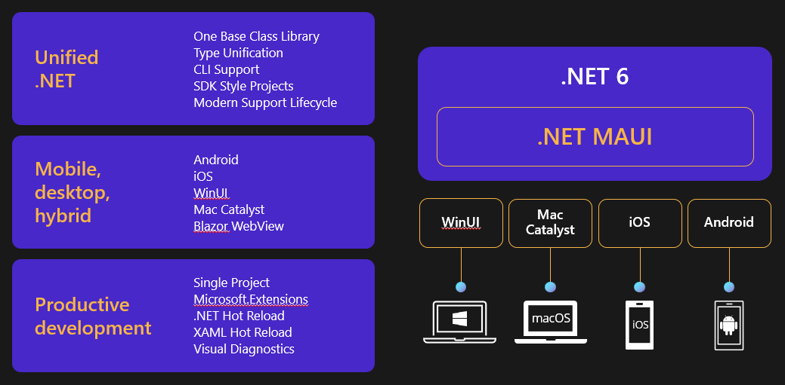
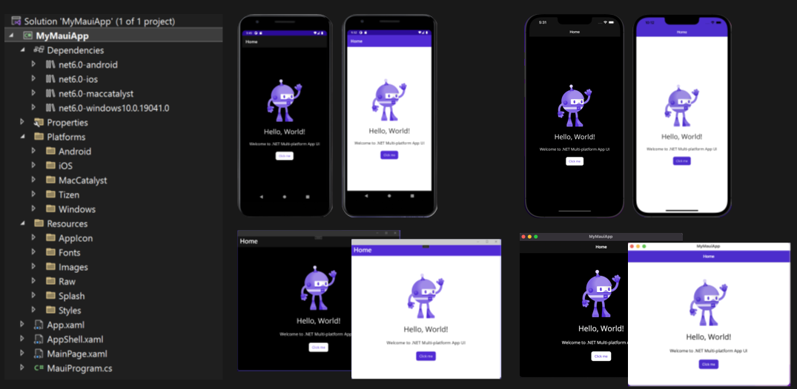
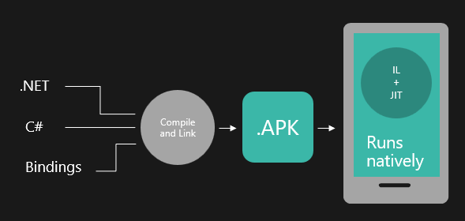
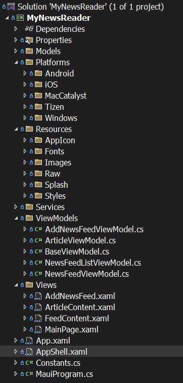

## Part 0 - Overview

This workshop will be a hands on and a bring your own device workshop. You can develop on PC or Mac and all you will need to do is install Visual Studio 2022 or Visual Studio for Mac 2022 with the .NET MAUI workload. It is built on .NET 7, which means you will need version 17.4 of Visual Studo 2022 or newer.

Before starting the workshop, I recommend going through [the quick 10 minute .NET MAUI Tutorial](https://learn.microsoft.com/dotnet/maui/get-started/first-app) that will guide you through installation and also ensuring everything is configured correct.

If you are new to mobile development, we recommend deploying to a physical Android device which can be setup in just a few steps. If you don't have a device, don't worry as you can [setup an Android emulator with hardware acceleration](https://learn.microsoft.com/xamarin/android/get-started/installation/android-emulator). If you don't have time to set this up ahead of time, don't worry as we are here to help during the workshop.

## About .NET MAUI

.NET Multi-platform App UI is the most productive way to develop native apps with a single codebase that perform great on any consumer device.

In order to reach all of these devices with beautiful app experiences, we built .NET MAUI to be the most productive way to develop native apps with a single codebase that perform great on any device. Instead of learning different stacks and languages for each device, you can use one language, one set of libraries, and one UI stack for all of them. 

APIs are available directly from C# to access over 60 device platform features including things like isolated storage, sensors, geolocation, camera, and more. Use one programming language, one codebase, and one project system for all device targets with support for cross-platform resources including images, icons, splash screens, and more. .NET MAUI on Windows supports WinUI allowing these apps to use all the newest native features on supported versions of Windows 10 and 11. 



.NET MAUI is built on .NET 6, so that means that you get a single, unified .NET experience across workloads and project types. There is one base class library and unified type system with CLI support. 

.NET MAUI under the hood uses technologies out there today for building native apps on Windows with WinUI, Mac Catalyst for macOS, and of course, iOS and Android. .NET MAUI abstracts all those frameworks into a single framework built on .NET 6. 

.NET MAUI lets web developers build hybrid web apps too. Share Blazor web components directly in .NET MAUI apps while having access to native device capabilities and packaging. By using .NET MAUI and Blazor together, you can reuse one set of web UI components across mobile, desktop, and web.

Visual Studio 2022 includes Hot Reload technology to make you much more productive building .NET MAUI apps. Type code, hit save, and see the changes right away. You can also take advantage of the latest debugging, IntelliSense, and testing features of Visual Studio to write better code faster.



### Native Compilation

Native compilation means that we can compile our C# application to use:

- Android:
  - android.widget
  - AndroidX Libraries
  - Java/Kotlin APIs
- iOS:
  - UIKit
  - ARKit, AVKit, Carplay, and dozens more
  - Objective-C, Swift APIs
- Mac Catalyst
  - UIKit and AppKit
  - Dozens of frameworks
  - Objective-C / Swift APIs
- Windows Applications
  - Windows App SDK
  - WinUI 3
  - C++ APIs

When compiling for iOS:


Code is compiled to a native ARM Binary and deployed as a .APP file to the device

When compiling for Android:



Code is compiled, linked and provided as an .APK that the Google Play store repackages for the various devices they support

### Available Features

| Features | New Capabilities | Changes from Xamarin |
| --- | --- | --- |
| MVVM & XAML | BlazorWebView | Color / Colors |
| Android, iOS, macOS, Windows | Border | Zero'd defaults |
| 7 layouts | Shadows | Namespace |
| 44 Views | GraphicsView | More XAMLC |
| Maui.Essentials | MenuBar | App Startup |
| Maui.Graphics | Windows/Multi-Window | Lifecycle Events |
| Xamarin Forms Compat | Default Theme | .NET Workloads |
| Community Toolkit | AppIcon | |
| | Splash Screen | |
| | Fonts | |
| | Images | |
| | Shell Flyout Templates | |


### Open Solution in Visual Studio

1. Open **Part 1 - Displaying Data/MyNewsReader.sln**

This MyNewsReader contains 1 project:

* MyNewsReader - The main .NET MAUI project that targets Android, iOS, macOS, and Windows. It includes all scaffolding for the app including Models, Views, ViewModels, and Services.



The **MyNewsReader** project also has blank code files and XAML pages that we will use during the workshop. All of the code that we modify will be in this project for the workshop.

### Understanding the .NET MAUI single project

.NET Multi-platform App UI (.NET MAUI) single project takes the platform-specific development experiences you typically encounter while developing apps and abstracts them into a single shared project that can target Android, iOS, macOS, and Windows.

.NET MAUI single project provides a simplified and consistent cross-platform development experience, regardless of the platforms being targeted. .NET MAUI single project provides the following features:

- A single shared project that can target Android, iOS, macOS, and Windows.
- A simplified debug target selection for running your .NET MAUI apps.
- Shared resource files within the single project.
- Access to platform-specific APIs and tools when required.
- A single cross-platform app entry point.

.NET MAUI single project is enabled using multi-targeting and the use of SDK-style projects in .NET 6 and later.

#### Resource files

Resource management for cross-platform app development has traditionally been problematic. Each platform has its own approach to managing resources, that must be implemented on each platform. For example, each platform has differing image requirements that typically involves creating multiple versions of each image at different resolutions. Therefore, a single image typically has to be duplicated multiple times per platform, at different resolutions, with the resulting images having to use different filename and folder conventions on each platform.

.NET MAUI single project enables resource files to be stored in a single location while being consumed on each platform. This includes fonts, images, the app icon, the splash screen, and raw assets.

> IMPORTANT:
> Each image resource file is used as a source image, from which images of the required resolutions are generated for each platform at build time.

Resource files should be placed in the _Resources_ folder of your .NET MAUI app project, or child folders of the _Resources_ folder, and must have their build action set correctly. The following table shows the build actions for each resource file type:

| Resource | Build action |
| -------- | ------------ |
| App icon | MauiIcon |
| Fonts | MauiFont |
| Images | MauiImage |
| Splash screen | MauiSplashScreen |
| Raw assets | MauiAsset |

<!--| CSS files | MauiCss | -->

> NOTE:
> XAML files are also stored in your .NET MAUI app project, and are automatically assigned the **MauiXaml** build action when created by project and item templates. However, XAML files will not typically be located in the _Resources_ folder of the app project.

When a resource file is added to a .NET MAUI app project, a corresponding entry for the resource is created in the project (.csproj) file. After adding a resource file, its build action can be set in the **Properties** window. The following screenshot shows a _Resources_ folder containing image and font resources in child folders:


Child folders of the _Resources_ folder can be designated for each resource type by editing the project file for your app:

```xml
<ItemGroup>
    <!-- Images -->
    <MauiImage Include="Resources\Images\*" />

    <!-- Fonts -->
    <MauiFont Include="Resources\Fonts\*" />

    <!-- Raw Assets (also remove the "Resources\Raw" prefix) -->
    <MauiAsset Include="Resources\Raw\**" LogicalName="%(RecursiveDir)%(Filename)%(Extension)" />
</ItemGroup>
```

The wildcard character (`*`) indicates that all the files within the folder will be treated as being of the specified resource type. In addition, it's possible to include all files from child folders:

```xml
<ItemGroup>
    <!-- Images -->
    <MauiImage Include="Resources\Images\**\*" />
</ItemGroup>
```

In this example, the double wildcard character ('**') specifies that the _Images_ folder can contain child folders. Therefore, `<MauiImage Include="Resources\Images\**\*" />` specifies that any files in the _Resources\Images_ folder, or any child folders of the _Images_ folder, will be used as source images from which images of the required resolution are generated for each platform.

Platform-specific resources will override their shared resource counterparts. For example, if you have an Android-specific image located at _Platforms\Android\Resources\drawable-xhdpi\logo.png_, and you also provide a shared _Resources\Images\logo.svg_ image, the Scalable Vector Graphics (SVG) file will be used to generate the required Android images, except for the XHDPI image that already exists as a platform-specific image.

### App icons

An app icon can be added to your app project by dragging an image into the _Resources\Images_ folder of the project, and setting the build action of the icon to **MauiIcon** in the **Properties** window. This creates a corresponding entry in your project file:

```xml
<MauiIcon Include="Resources\Images\appicon.png" />
```

At build time, the app icon is resized to the correct sizes for the target platform and device. The resized app icons are then added to your app package. App icons are resized to multiple resolutions because they have multiple uses, including being used to represent the app on the device, and in the app store.

#### Images

Images can be added to your app project by dragging them to the _Resources\Images_ folder of your project, and setting their build action to **MauiImage** in the **Properties** window. This creates a corresponding entry per image in your project file:

```xml
<MauiImage Include="Resources\Images\logo.jpg" />
```

At build time, images are resized to the correct resolutions for the target platform and device. The resized images are then added to your app package.

#### Fonts

True type format (TTF) and open type font (OTF) fonts can be added to your app project by dragging them into the _Resources\Fonts_ folder of your project, and setting their build action to **MauiFont** in the **Properties** window. This creates a corresponding entry per font in your project file:

```xml
<MauiFont Include="Resources\Fonts\OpenSans-Regular.ttf" />
```

At build time, the fonts are copied to your app package.

<!-- For more information, see [Fonts](~/user-interface/fonts.md). -->

#### Splash screen

A slash screen can be added to your app project by dragging an image into the _Resources\Images_ folder of your project, and setting the build action of the image to **MauiSplashScreen** in the **Properties** window. This creates a corresponding entry in your project file:

```xml
<MauiSplashScreen Include="Resources\Images\splashscreen.svg" />
```

At build time, the splash screen image is resized to the correct size for the target platform and device. The resized splash screen is then added to your app package.

#### Raw assets

Raw asset files, such as HTML, JSON, and videos, can be added to your app project by dragging them into the _Resources_ folder of your project (or a sub-folder, such as _Resources\Assets_), and setting their build action to `MauiAsset` in the **Properties** window. This creates a corresponding entry per asset in your project file:

```xml
<MauiAsset Include="Resources\Assets\index.html" />
```

Raw assets can then be consumed by controls, as required:

```xaml
<WebView Source="index.html" />
```

At build time, raw assets are copied to your app package.

### Understanding .NET MAUI app startup

.NET Multi-platform App UI (.NET MAUI) apps are bootstrapped using the .NET Generic Host model. This enables apps to be initialized from a single location, and provides the ability to configure fonts, services, and third-party libraries.

Each platform entry point calls a `CreateMauiApp` method on the static `MauiProgram` class that creates and returns a `MauiApp`, the entry point for your app.

The `MauiProgram` class must at a minimum provide an app to run:

```csharp
namespace MyMauiApp;

public static class MauiProgram
{
    public static MauiApp CreateMauiApp()
    {
        var builder = MauiApp.CreateBuilder();
        builder
            .UseMauiApp<App>();

        return builder.Build();
    }
}  
```

The `App` class derives from the `Application` class:

```csharp
namespace MyMauiApp;

public class App : Application
{
    public App()
    {
        InitializeComponent();

        MainPage = new AppShell();
    }
}
```

#### Register fonts

Fonts can be added to your app and referenced by filename or alias. This is accomplished by invoking the `ConfigureFonts` method on the `MauiAppBuilder` object. Then, on the `IFontCollection` object, call the `AddFont` method to add the required font:

```csharp

namespace MyMauiApp;

public static class MauiProgram
{
    public static MauiApp CreateMauiApp()
    {
        var builder = MauiApp.CreateBuilder();
        builder
            .UseMauiApp<App>()
            .ConfigureFonts(fonts =>
            {
                fonts.AddFont("OpenSans-Regular.ttf", "OpenSansRegular");
            });

        return builder.Build();
    }
}
```

In the example above, the first argument to the `AddFont` method is the font filename, while the second argument represents an optional alias by which the font can be referenced when consuming it.

Any custom fonts consumed by an app must be included in your .csproj file. This can be accomplished by referencing their filenames, or by using a wildcard:

```xml
<ItemGroup>
   <MauiFont Include="Resources\Fonts\*" />
</ItemGroup>
```

> NOTE:
> Fonts added to the project through the Solution Explorer in Visual Studio will automatically be included in the .csproj file.

The font can then be consumed by referencing its name, without the file extension:

```xaml
<!-- Use font name -->
<Label Text="Hello .NET MAUI"
       FontFamily="OpenSans-Regular" />
```

Alternatively, it can be consumed by referencing its alias:

```xaml
<!-- Use font alias -->
<Label Text="Hello .NET MAUI"
       FontFamily="OpenSansRegular" />
```


Now that you have a basic understanding of the .NET MAUI project, let's start building an app! Head over to [Part 1](../1-BindingData/README.md).
